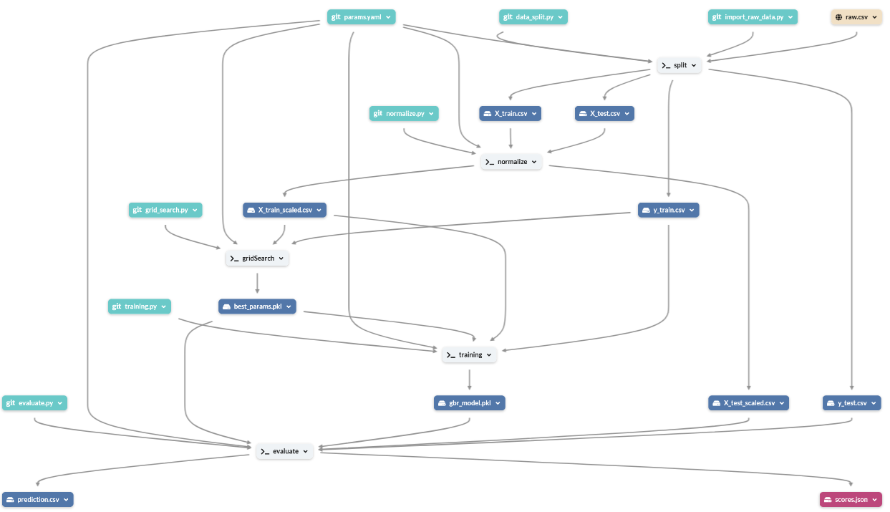

# Examen DVC and Dagshub
- **Author**: Eddie JAFFUEL
- **Delivery Date**: Branch "**Master**" / **1.0** / 27 oct 2024
- **Github repository**: https://github.com/ejaffuel/examen-dvc
- **DagsHub repository**: https://dagshub.com/ejaffuel/examen-dvc
---
## Installation guide
- Create and activate your virtual environment and install packages with:
    - ```pip install -r requirements.txt```
---
## User guide
- Launch pipeline with 
    - ```dvc repro```
- Pipeline parameters : 
- Pipeline definition : 
- Pipeline visualization : 
---
## Tree of Folders and files (managed under **Git**)
```git ls-tree -r --name-only HEAD | tree --fromfile```
```
├── .dvc
│   └── config
├── .dvcignore
├── .gitignore
├── requirements.txt    The requirements of the package to install
├── setup.py            To manage package dependency import

├── README.md           The main documentation 
├── docs                Other elements used in documentation

├── dvc.yaml            The configuration of the pipeline
├── params.yaml         The parameters of the pipeline
├── dvc.lock            The result of pipeline execution

├── data                DVC Data folder
│   ├── raw_data            Original dataset with label
│   ├── processed           Used to store processed dataset split in (X|y)_(train|test)
│   └── predict             Used to store predictions
├── models              DVC Output Model data folder (best_params, training model)
├── metrics             DVC Output Folder for metric performance (scores)

└── src                     The Source code folder (contain all scripts)
    ├── common_utils.py         several utility functions

    ├── config.py               Path to configuration YAML file (params.YAML)
    ├── entity.py               Mirror classes for configuration YAML file
    ├── config_manager.py       Mapping between Mirror classes and configuration YAML file

    ├── data                    Scrits to manage the processed data
    │   ├── check_structure.py      Utilities functions
    │   ├── import_raw_data.py      Step1: import raw data from distant repository
    │   ├── data_split.py           Step2: split raw data in (X|y)_(train|test)
    │   └── normalize.py            Step3: normalize X_(train|test) => X_(train|X_test)_scaled

    └── models                  Scripts to manage the model training and evaluation
        ├── grid_search.py          Step4: Perform a Grid Search to find best hyperparameters
        ├── training.py             Step5: Train the model with best hyperparameters
        └── evaluate.py             Step6: Evaluate the model
```
